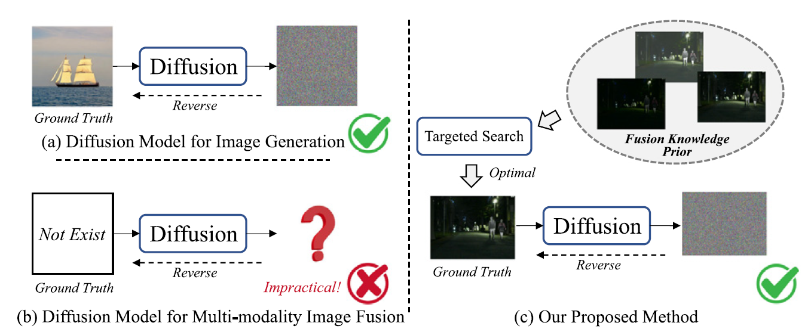

# [Information Fusion 2024] Diff-IF: Multi-modality image fusion via diffusion model with fusion knowledge prior
### [Paper](https://www.sciencedirect.com/science/article/pii/S1566253524002288) | [Code](https://github.com/XunpengYi/Diff-IF)

**Yi, Xunpeng, et al. "Diff-IF: Multi-modality image fusion via diffusion model with fusion knowledge prior." 
Information Fusion (2024): 102450.**



## 1. Create Environment
- Create Conda Environment
```
conda create -n diffif_env python=3.9
conda activate diffif_env
```
- Install Dependencies
```
conda install pytorch==2.0.0 torchvision==0.15.0 pytorch-cuda=11.8 -c pytorch -c nvidia
pip install -r requirements.txt
```
We strongly recommend the configurations in the requirements.txt, for some old versions of dependencies may not support some new functions.

## 2. Prepare Your Dataset

You can also refer to [MFNet](https://www.mi.t.utokyo.ac.jp/static/projects/mil_multispectral/), [RoadScene](https://github.com/hanna-xu/RoadScene), [LLVIP](https://github.com/bupt-ai-cz/LLVIP) to prepare your data. 

If you want to test only, you should list your dataset as the followed rule:
```bash
# Infrared and visible image fusion:
    dataset/
        your_dataset/
            test/
                Infrared/
                Visible/
                
# Medical image fusion:
    dataset/
        your_dataset/
            test/
                CT-PET-SPECT/
                MRI/
```

## 3. Pretrain Weights
We provide the pretrain weights for infrared and visible image fusion and medical image fusion. Download the weight and put it into the `weights` folder.

The pretrain weight for infrared and visible image fusion is at [Google Drive](https://drive.google.com/file/d/18UBD4C9w-KNvAF1oowSV0dMTYbj6NdF-/view?usp=sharing) | [Baidu Drive](https://pan.baidu.com/s/1yc-pvp_Ow8slS-RufzOwdg) (code: 82nm).

The pretrain weight for medical image fusion is at [Google Drive](https://drive.google.com/file/d/1R3k_AEQ0TDrNuHoep_83G_omGg90xoPu/view?usp=sharing) | [Baidu Drive](https://pan.baidu.com/s/10CJEWmCozWnt0Ik2fCXLqQ) (code: 7u1g).

## 4. Testing
For infrared and visible image fusion or medical image fusion test, you can use:
```shell
# Infrared and visible fusion
CUDA_VISIBLE_DEVICES=0 python infer_ddim.py  --config config/diff-if-ivf_val.json

# Medical image fusion
CUDA_VISIBLE_DEVICES=0 python infer_ddim.py  --config config/diff-if-mif_val.json
```


## 5. Train
Please refer to existing methods to achieve fusion knowledge prior construction of training sets. We recommend the [U2Fusion](https://github.com/hanna-xu/U2Fusion), [TarDAL](https://github.com/JinyuanLiu-CV/TarDAL), [DDFM](https://github.com/Zhaozixiang1228/MMIF-DDFM), [MetaFusion](https://github.com/wdzhao123/MetaFusion), etc.
You can also organize your own fusion knowledge prior based on your needs. We encourage the researchers to do this.

You should list your fusion knowledge prior as followed rule:
```bash
    dataset/
        fusion_knowledge_prior/
          Knowledge_U2Fusion/
          Knowledge_TarDAL/
          Knowledge_DDFM/
          Knowledge_MetaFusion/
          ...
```

### Get the fusion knowledge prior
We also encourage the researchers to use the customized targeted search based on the needs.
```shell
python targeted_search.py
```
Please move your fusion knowledge (Fusion_K) into the training datasets before training the model. For infrared and visible image fusion, you can list your dataset as followed rule (the folder of Fusion_K will be produced by the targeted search):
```bash
    dataset/
        your_dataset/
            train/
                Fusion_K/
                Infrared/
                Visible/
            eval/
                Infrared/
                Visible/
```
Similarly, the way of training the medical image fusion is simple, referring to the section of prepared your dataset.

### Train the Model
```shell
# Infrared and visible fusion
CUDA_VISIBLE_DEVICES=0 python train.py  --config config/diff-if-ivf.json

# Medical image fusion
CUDA_VISIBLE_DEVICES=0 python train.py  --config config/diff-if-mif.json
```
 

## Citation
If you find our work useful for your research, please cite our paper. 
```
@article{yi2024diff,
  title={Diff-IF: Multi-modality image fusion via diffusion model with fusion knowledge prior},
  author={Yi, Xunpeng and Tang, Linfeng and Zhang, Hao and Xu, Han and Ma, Jiayi},
  journal={Information Fusion},
  pages={102450},
  year={2024},
  publisher={Elsevier}
}
```
If you have any questions, please send an email to xpyi2008@163.com. 
